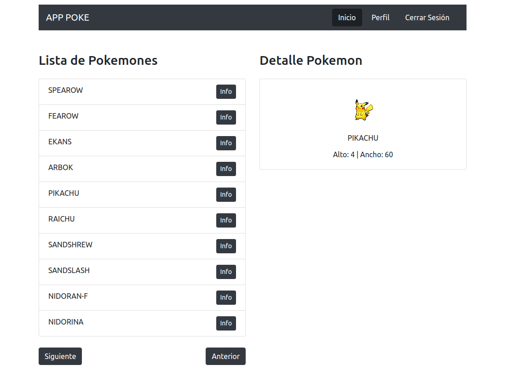
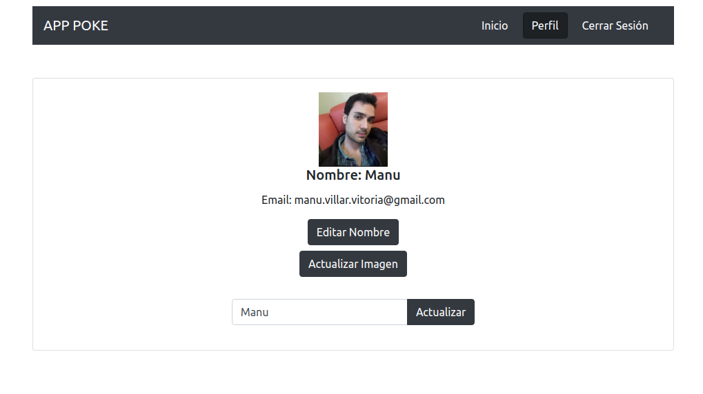

# `Pokemons List`

* This app is a SPA that connect with a Pokemon API, that have 3 protected routes (Login, Profile, Home).   
- On the Login page the user can sign up or login with Google Authentification.  
- On the Home page is displayed a list of pokemons names with his detail.  
- On the Profile Page is displayed the image, name and email of user, where the name and image can be updated.  

This is the frontend repository, built with **React Hooks + Redux + Firebase + Bootstrap 4 + LocalStorage**.  
* Check out the **[DEPLOYED SITE]**(https://react-redux-pokemonslist.web.app/)

## UI

### Home

### Profile

## Built with 🛠️

The **Technologies & Core Packages** used to create the project have been the following:

1. **Redux** - State Management  
   <code>npm i redux react-redux redux-devtools redux-thunk</code>  
    - Extensions of Google Chrome: [Redux DevTools](https://chrome.google.com/webstore/detail/redux-devtools/lmhkpmbekcpmknklioeibfkpmmfibljd?utm_source=chrome-ntp-icon) 
    - Documentation: [Redux](https://es.redux.js.org/) | [Ducks: Redux Reducer Bundles](https://github.com/erikras/ducks-modular-redux#the-proposal)  
2. **React Hooks (useState, useDispatch, useSelector)** - Functional Components  
   <code>npx create-react-app my-app</code>  
   - Extensions of Google Chrome: [React Developer Tools](https://chrome.google.com/webstore/detail/react-developer-tools/fmkadmapgofadopljbjfkapdkoienihi?utm_source=chrome-ntp-icon) 
   - Documentation: [React Hooks](https://es.reactjs.org/docs/hooks-intro.html)  
3. **React Router** - Routing  
   <code>npm i react-router-dom</code>  
   - Documentation: [React Router](https://reactrouter.com/web/guides/quick-start)  
4. **Bootstrap 4** -Styles  
   <code>npm i bootstrap</code>  
   - Documentation: [Bootstrap](https://getbootstrap.com/docs/4.5/getting-started/introduction/)  
5. **Axios** - Network calls  
   <code>npm i axios</code>  
6. **API** - **[PokeApi]**(https://pokeapi.co/)  
7. **Firestore (Firebase)** - Data Base  
   <code>npm i firebase</code>  
   - Documentation: [Cloud Firestore](https://firebase.google.com/docs/firestore?hl=es) 
8. **Authentication with Google (Firebase)** - Login/Signup  
   <code>npm i firebase</code>  
   - Documentation: [Acces with Google](https://firebase.google.com/docs/auth/web/google-signin#handle_the_sign-in_flow_with_the_firebase_sdk) 
9. **Storage (Firebase)** - Image Management  
   <code>npm i firebase</code>  
   - Documentation: [Storage](https://firebase.google.com/docs/storage/web/start?hl=es) 
10. **Hosting (Firebase)** - Host on Firebase Hosting  
   <code>npm run build</code> (Do it to push it to production and everytime you  update the project).  
   <code>sudo npm install -g firebase-tools</code> (Install in the computer (just do it one time). 
   <code>firebase login</code> (Acces to Google). 
   <code>firebase init</code> (Start the project. Steps:  
    1. Choose Firebase & Hosting (Select with 'space key')
    2. Select the project.
    3. Updating the name of public directory to **'build'**.
    4. Overwrite index.html? NO  
   <code>firebase deploy</code> (Do it everytime you update the project). 
  - Documentation: [Basic security rules of Firebase](https://firebase.google.com/docs/rules/basics) 

## Features ✒️

1. Login/Signup with Google Authentication (Firebase).
2. SPA with protected Routes.
3. Displaying list the pokemons names with pagination through consuming an API,  
and  a detail of his image.
4. Saving the API's requests to the LocalStorage.
5. Displaying user's profile page, where we can updating the user name and profile  
image throught the Storage (Firebase).
6. The user's data will be save in Firestore DB (Firebase) and LocalStorage.

## Running locally 🔧

Do <code>git clone</code> to this repository and then run the following:   
<code>npm i</code> and <code>npm start</code>*(localhost:3000)* to see the app in action.

## Expressions of gratitude 🎁

* First of all, I thank the only true God, Father, Son and Holy Spirit.  
"For from him and through him and for him are all things.  
To him be the glory forever! Amen.  
<code>(Romans 11:36)</code> 📢

---
⌨️ with ❤️ by [ManuelVillarVitoria](https://github.com/ManuelVillarVitoria) 😊

